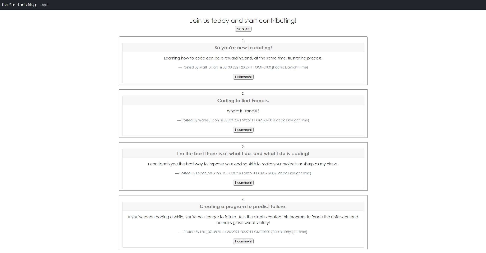

  # Tech Blog MVC

  ## **Description**
  A CMS-style blog site where one can publish articles, blog posts, or thoughts and opinions and also view those and others posts.

  ## **Images**
  
  
  ## **Table of Contents**
  
  * [Installation](#dependencies)
  * [Usage](#usage)
  * [Credits](#credits)
  * [License](#license)
  * [Features](#features)
  * [Languages](#languages)
  * [Technology](#technology)
  * [Tests](#tests)
  * [Contribute](#contribute)
  
  ## **Installation**
  In the terminal, enter the following dependencies:
  
  npm install express-handlebars

  npm install --save mysql2

  npm i sequelize

  npm install dotenv

  npm install bcrypt

  npm install express-session

  npm install connect-session-sequelize

  ## **Usage**
  Once all the dependencies are installed, open the termial and type 'npm start'. Then load your local host to view the program.

  ## **Credits**
  

  ## **License**
  
   
  https://opensource.org/licenses/MIT
   

  ## **Features**
  https://safe-sands-00186.herokuapp.com/
  

  ## **Languages**
   CSS, HTML, JavaScript, Handlebars

  ## **Technology**
  https://www.npmjs.com/package/express-handlebars

  https://www.npmjs.com/package/mysql2

  https://www.npmjs.com/package/sequelize

  https://www.npmjs.com/package/dotenv

  https://www.npmjs.com/package/bcrypt

  https://www.npmjs.com/package/express-session

  https://www.npmjs.com/package/connect-session-sequelize

  ## **Tests**
  No test have been created for this project

  ## **Contribute**
  Find me on [GitHub](https://www.github.com/mattbisbee)
   
  Send me an [Email](mailto:aldhelm7@gmail.com)
   
  [Contributor Covenant](https://www.contributor-covenant.org/)
